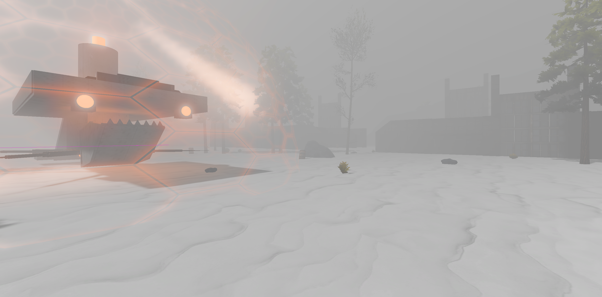

# Tundra

## How to play

1. Goal: Collect Data Frames
2. Fuel your Castle
3. Start the Castle engine
4. Defend from enemies
5. Stay close to stay warm!

## Keybindings

| Action         | Keybinding                |
| -------------- | ------------------------- |
| Open Menu      | [ESC] / [Tab]             |
| Move           | [WASD]                    |
| Interact       | [E]                       |
| Fire - Primary | [Left Mouse]              |
| Aim            | [Right Mouse]             |
| -              | [Mouse Button 3]          |
| Melee          | [V] / [Mouse Button 4]    |
| Swap Weapon    | [1] / [2] / [Mouse Wheel] |
| Drop Weapon    | [G]                       |
| Reload         | [R]                       |
| Jump           | [Space]                   |
| Shift          | [Sprint]                  |

# How start a game

### Connect to the Tundra server

- Unzip
- Run .exe
- Allow when prompted for security warning
  - (Generally do not do this for untrusted sources!)
- In Game:
  - Join
  - Enter the IP address to the Tundra Server (ask me on Discord)
  - NOTE: For P2P, use Noray via Netfox _it may or may not work_)

## Test Locally:

- Clone this repo
- Open [Godot 4.5](https://godotengine.org/download/archive/)
- Import the project
- Open the menu -> Debug -> Choose Customize Run Instances
- Click Enable Multiple Instances
- Choose 2 (or more)
- Set up a host
  - Add an Override Main Arg as `--headless`
  - Add a Feature Tag `server`
- Set up a joiner
  - Add a feature gat `join`
- Hit Play
- The game should start and drop you into a local host instance.

# Forked from Battery Acid Dev's:

## https://github.com/BatteryAcid/godot-3d-multiplayer-template

A very basic multiplayer template set in a 3D world. Use this as a starting point for your game or a quick way to prototype functionality.

- Synchronizes player movement and animations: Idle, Walk/Run, Jump, and Fall
- Uses [Netfox](https://github.com/foxssake/netfox) for lag compensation
- Netfox's [RewindableStateMachine](https://foxssake.github.io/netfox/netfox.extras/guides/rewindable-state-machine/) for state based movement
- Basic main menu
- Can run as [host or dedicated server](https://youtu.be/jgJuX04cq7k)

## Also uses:

- Mixamo models
- Mixamo animations
- FPS template from the asset store (not recommended)
- A few Kenny assets (guns)
- Sketchfab assets
